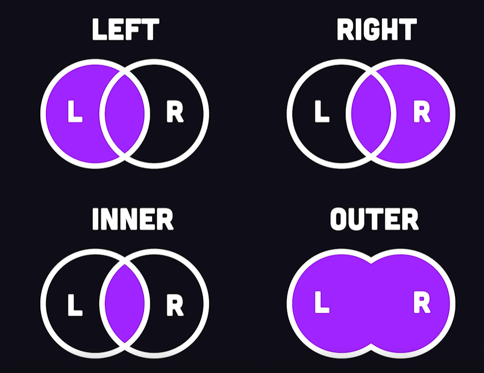
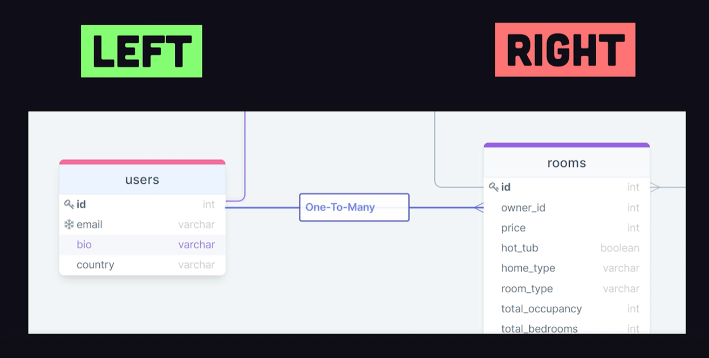

# Relationships
There are primarily 3, `One to One`, `Many to one`(`One to Many`) and `Many to Many`

For this example, let's `create` a new `table` with `id`, `street` and `owner_id`
- the `Foreign Key` in this table references the `id` of the `Users` table.

```
CREATE TABLE Rooms(
	id INT AUTO_INCREMENT,
	street VARCHAR(255),
	owner_id INT NOT NULL

	PRIMARY KEY(id),
	FOREIGN KEY(owner_id) REFERENCES Users(id)
);
```


Insert some data:
```
INSERT INTO Rooms (owner_id, street)
VALUES
	(1, 'tomato land'),
	(1, 'somewhere i think');
```

### JOIN

Query users that own rooms.

There are 4 different type of joins:


MySQL does not actually support full outer joins - it uses left, right and union.



When a join is performed, it matches the user ID and the ID of the room's owner, so not every user will have a room.


Run this to get all users with rooms:

```
SELECT * FROM Users
INNER JOINS ROoms
ON Rooms.owner_id = Users.id;
```

Get all users regardless if they have a room or not (if the user does not have a room, it will return `NULL`):
```
SELECT * FROM Users
LEFT JOIN Rooms
ON Rooms.owner_id = Users.id;
```

Get all the rooms without an associated owner:
```
SELECT * FROM Users
RIGHT JOIN Rooms
ON Rooms.owner_id = Users.id;
```


What an Outer Join would be like (not supported):
```
SELECT * FROM Users
FULL OUTER JOIN Rooms
ON Rooms.owner_id = Users.id;
```


### ALIASES
```
SELECT
	Users.id AS user_id.
	Rooms.id AS room_id,
	email,
	street

FROM Users
INNER JOIN Rooms ON Rooms.owner_id = Users.id;
```

# Bookings
User has booked many rooms, room has been booked by users.

```
CREATE TABLE Bookings(
	id INT AUTO_INCREMENT,
	guest_id INT NOT NULL,
	room_id INT NOT NULL,
	check in DATETIME,
	PRIMARY KEY (id),
	FOREIGN KEY (guest_id) REFERENCES Users(id),
	FOREIGN KEY (room_id) REFERENCES Rooms(id)
);
```

### Joins (again)
Joins through the booking tables.
Fetch all the rooms a user booked and fetching by the guest id (after joining rooms to bookings)